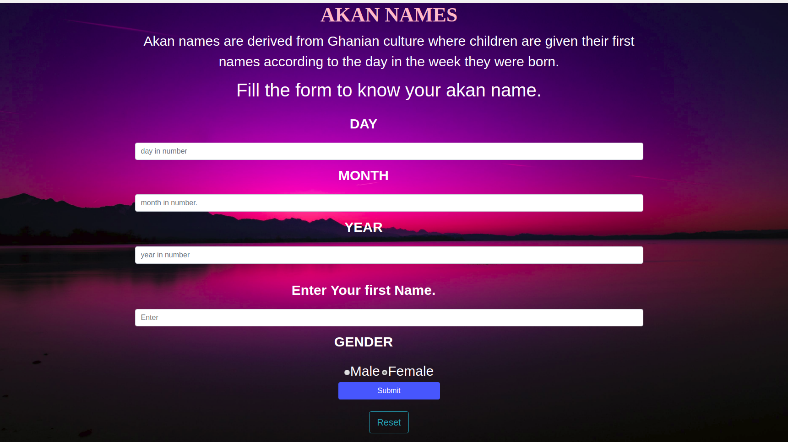

# Akan Names

## Author
- LOISE MUTHONI

## Description
- This is a website that helps the user to know their Akan names by giving out their birth date.

## Set Up Instructions
- Must have a github accout
- Must have internet connection

# Tech Used
- HTML
- CSS
- JS
- BOOTSTRAP

## BDD
 

- When you want to get your akan name, enter the day when you were born. Eg day: 2, month:3 year:2003 and your name then submit. If you want to reset you can just click reset.

## Known Bugs
- No Known Bugs

## Live Link
- https://loisemuthoni.github.io/project2/

# Contact Info
- Email: loisemburu01@gmail.com

# License
The MIT License (MIT)

Copyright (c) 2019 Loise Muthoni

Permission is hereby granted, free of charge, to any person obtaining a copy of this software and associated documentation files (the "Software"), to deal in the Software without restriction, including without limitation the rights to use, copy, modify, merge, publish, distribute, sublicense, and/or sell copies of the Software, and to permit persons to whom the Software is furnished to do so, subject to the following conditions:

The above copyright notice and this permission notice shall be included in all copies or substantial portions of the Software.

THE SOFTWARE IS PROVIDED "AS IS", WITHOUT WARRANTY OF ANY KIND, EXPRESS OR IMPLIED, INCLUDING BUT NOT LIMITED TO THE WARRANTIES OF MERCHANTABILITY, FITNESS FOR A PARTICULAR PURPOSE AND NONINFRINGEMENT. IN NO EVENT SHALL THE AUTHORS OR COPYRIGHT HOLDERS BE LIABLE FOR ANY CLAIM, DAMAGES OR OTHER LIABILITY, WHETHER IN AN ACTION OF CONTRACT, TORT OR OTHERWISE, ARISING FROM, OUT OF OR IN CONNECTION WITH THE SOFTWARE OR THE USE OR OTHER DEALINGS IN THE SOFTWARE
